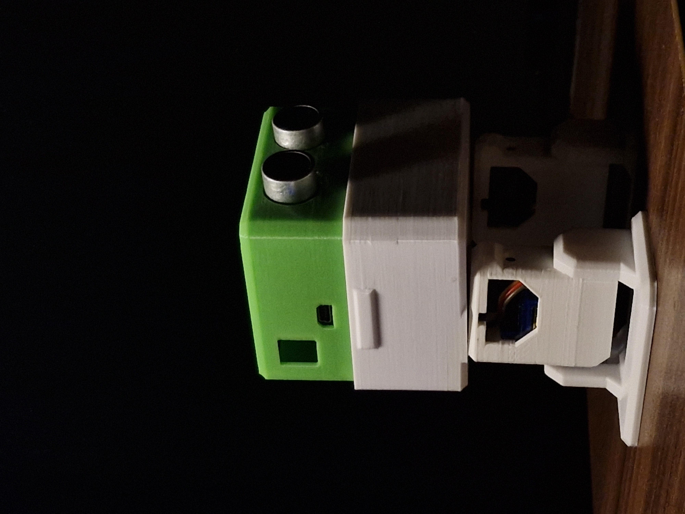
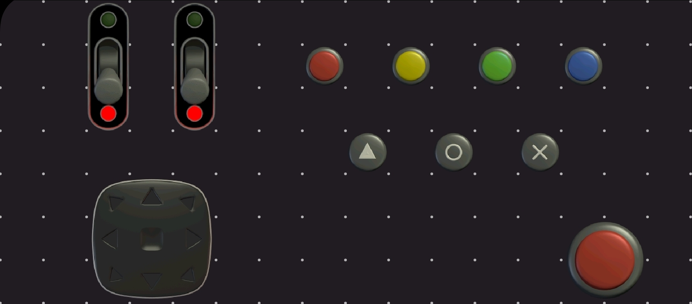

# 🤖 Otto DIY Smart Robot

An Arduino Nano-based humanoid robot capable of Bluetooth control, autonomous obstacle avoidance, and interactive dance routines.

<p align="center">
  
</p>
---
 
# 📚 Table of Contents

- Overview
- Features
- Hardware Used
- Power System
- Pin Connections
- Bluetooth Control
- Installation
- Repository Structure
- Future Improvements
- License

---

# 📖 Overview

This project is an enhanced version of the classic Otto DIY robot built using an Arduino Nano. It combines Bluetooth control with autonomous obstacle avoidance while providing stable walking, turning, and dance routines.

The robot is powered by a single 18650 Li-ion battery with a TP4056 USB-C charging module and an MT3608 boost converter adjusted to approximately **6V**.

---

# ✨ Features

- 🚶 Walk Forward / Backward
- ↩️ Turn Left / Right
- 📱 Bluetooth Control (HC-05)
- 🚧 Obstacle Avoidance
- 💃 Multiple Dance Routines
- 🔊 Buzzer Feedback
- 🏠 Home Position
- ⚡ Responsive Motion Engine

---

# 🛠 Hardware Used

| Component | Qty |
|-----------|----:|
| Arduino Nano | 1 |
| SG90 Servo | 2 |
| MG90 Servo | 2 |
| HC-05 Bluetooth Module | 1 |
| HC-SR04 Ultrasonic Sensor | 1 |
| Active Buzzer | 1 |
| 18650 Battery | 1 |
| MT3608 Boost Converter | 1 |
| TP4056 USB-C Charging Module | 1 |
| DPDT Switch | 1 |
| 3-Pin DIP Switch | 1 |

---

# 🔋 Power System

```text
            USB-C
              │
              ▼
        +-------------+
        |   TP4056    |
        +-------------+
              │
              ▼
      18650 Li-ion Cell
              │
              ▼
      DPDT Power Switch
              │
              ▼
   MT3608 Boost Converter
        3.7V → ~6V
              │
     ┌────────┴────────┐
     │                 │
 Arduino Nano      4 Servos
     │
     ├── HC-05
     ├── HC-SR04
     └── Buzzer
```

---

# 🔌 Pin Connections

| Device | Pin |
|--------|-----|
| Left Leg Servo | D5 |
| Right Leg Servo | D3 |
| Left Foot Servo | D4 |
| Right Foot Servo | D2 |
| HC-SR04 Trigger | A3 |
| HC-SR04 Echo | A4 |
| HC-05 TX | RX |
| HC-05 RX | TX |

```text
                    Arduino Nano

                +------------------+
 Left Leg  <--- | D5           VIN |
Right Leg  <--- | D3           GND |
Left Foot  <--- | D4            5V |
Right Foot <--- | D2               |
                |                  |
 HC05 TX  ----> | RX            A3 | ---> HC-SR04 TRIG
 HC05 RX  <---- | TX            A4 | <--- HC-SR04 ECHO
                +------------------+
```

---

# 🎮 Bluetooth Electronics App Setup

This project uses **Bluetooth Electronics** by **Keuwlsoft**.

## 1. Pair the HC-05

- Power on the robot.
- Pair your phone with the HC-05.
- Default PIN: `1234` or `0000`.

## 2. Create a New Panel

1. Open **Bluetooth Electronics**.
2. Tap any empty panel.
3. Add **Push Buttons** for movement controls.
4. Edit each button and assign the corresponding character below.

| Button | Character to Send |
|--------|-------------------|
| ⬆ Forward | F |
| ⬇ Backward | B |
| ⬅ Left | L |
| ➡ Right | R |
| ↙ Back Left | J |
| ↘ Back Right | K |  
| ⏹ Emergency Stop | X |
| 🤖 Auto Mode | A | and 👤 Manual Mode | M | (add toggle switch for this)
| 🛡 Safety ON | O | and ⚠ Safety OFF | P |   (add toggle switch for this)
| 💃 Dance 1 | 1 |
| 💃 Dance 2 | 2 |
| 💃 Dance 3 | 3 |
| 💃 Dance 4 | 4 |
| 💃 Dance 5 | 5 |
| 💃 Dance 6 | 6 |
| 💃 Dance 7 | 7 |

> **Note:** Configure every button to send its assigned character when pressed.

<p align="center">
  
</p>

---

# 🚀 Installation

1. Clone the repository.
2. Open `OttoRobot.ino` in Arduino IDE.
3. Install required libraries.
4. Select **Arduino Nano (ATmega328P)**.
5. Upload the sketch.
6. Pair with the HC-05.
7. Control the robot using the Bluetooth Electronics app.

---

# 👨‍💻 Author

**Rishab Vernekar**

⭐ If you found this project useful, consider starring the repository.
